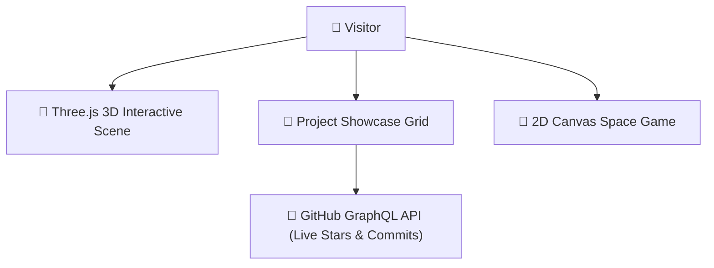

# 🚀 Sriniwas Awasthi — Personal Engineering Portfolio

**A modern, high-performance personal portfolio built with Next.js 15, TypeScript, Tailwind CSS v4, Framer Motion, and Live GitHub REST API Integration.**

---

🎓 **Student Developer:** 3rd Year Computer Science & Software Engineering Student  
🏛️ **Institution:** P.D.A College of Engineering, Kalaburagi, Karnataka, India  
🐙 **GitHub Profile:** [@SriniwasAwasthi](https://github.com/SriniwasAwasthi)

---

## 📑 Table of Contents

- [✨ Key Features](#-key-features)
- [🛠️ Tech Stack & Architecture](#️-tech-stack--architecture)
- [📁 Included 9 Featured Projects](#-included-9-featured-projects)
- [⚙️ Prerequisites & Environment Setup](#️-prerequisites--environment-setup)
- [🚀 Step-by-Step Installation & Run Guide](#-step-by-step-installation--run-guide)
- [📤 How to Push Updates to GitHub](#-how-to-push-updates-to-github)
- [📬 Contact & Social Links](#-contact--social-links)
- [

---

## 🏛️ System Architecture

---

## 💖 Thank You for Visiting & Exploring 🚀 Sriniwas Awasthi — Personal Engineering Portfolio!

> *"Thank you for taking the time to explore this project! Continuous learning, clean craftsmanship, and solving real-world challenges through elegant software are at the core of my developer journey."* 🚀

* 🌟 **Enjoyed this project?** If you found this repository interesting or helpful, please consider giving it a **Star**!
* 📬 **Let's Connect & Collaborate:** I am actively seeking engineering opportunities, impactful internships, and open-source collaborations. Feel free to connect via [GitHub](https://github.com/SriniwasAwasthi) or [Email](mailto:sriawasthi164@gmail.com).

---

  Designed & Crafted with Passion by <a href="https://github.com/SriniwasAwasthi"><strong>Sriniwas Awasthi</strong></a> • Continuous Learner & Software Engineer

