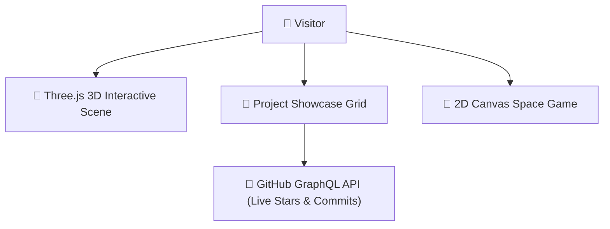

# 🚀 Sriniwas Awasthi — Personal Engineering Portfolio

**A modern, high-performance personal portfolio built with Next.js 15, TypeScript, Tailwind CSS v4, Framer Motion, and Live GitHub REST API Integration.**

---

🎓 **Student Developer:** 3rd Year Computer Science & Software Engineering Student  
🏛️ **Institution:** P.D.A College of Engineering, Kalaburagi, Karnataka, India  
🐙 **GitHub Profile:** [@SriniwasAwasthi](https://github.com/SriniwasAwasthi)

---

## 📑 Table of Contents

- [✨ Key Features](#-key-features)
- [🛠️ Tech Stack & Architecture](#️-tech-stack--architecture)
- [📁 Included 9 Featured Projects](#-included-9-featured-projects)
- [⚙️ Prerequisites & Environment Setup](#️-prerequisites--environment-setup)
- [🚀 Step-by-Step Installation & Run Guide](#-step-by-step-installation--run-guide)
- [📤 How to Push Updates to GitHub](#-how-to-push-updates-to-github)
- [📬 Contact & Social Links](#-contact--social-links)
- [

---

## 💖 Thank You for Exploring My Portfolio!

> *"Thank you for taking the time to inspect my software showcase!"* 🌐

Having you explore my portfolio website and review the projects I have poured my passion into is a true honor. As a software engineering student, every line of code represents a commitment to growth, clean architecture, and delightful user experiences.

- 🌟 **Enjoyed exploring my work?** Please leave a star on this repo to show your support!
- 📬 **Let's Connect & Collaborate:** I am actively seeking engineering roles, internship opportunities, and exciting collaborative projects. Let's connect on [GitHub](https://github.com/SriniwasAwasthi) or get in touch directly.

*Wishing you all the best in your endeavors, and thank you once again for visiting!* ✨

---

  Designed and built with pride by <a href="https://github.com/SriniwasAwasthi">Sriniwas Awasthi</a>.

## 🏛️ Portfolio Architecture

