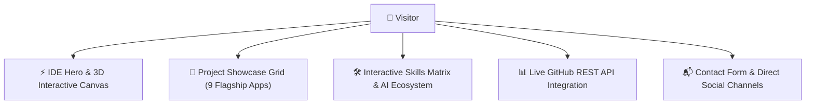

<div align="center">

# 🚀 Sriniwas Awasthi — Personal Engineering Portfolio

**A modern, high-performance personal portfolio built with Next.js 15, TypeScript, Tailwind CSS v4, Framer Motion, and Live GitHub REST API Integration.**

[](https://nextjs.org/)
[](https://www.typescriptlang.org/)
[](https://tailwindcss.com/)
[](https://www.framer.com/motion/)
[](https://opensource.org/licenses/MIT)

---

🎓 **Student Developer:** 3rd Year Computer Science & Software Engineering Student  
🏛️ **Institution:** P.D.A College of Engineering, Kalaburagi, Karnataka, India  
🐙 **GitHub Profile:** [@SriniwasAwasthi](https://github.com/SriniwasAwasthi)  
🌐 **Live Portfolio:** [Visit Live Site](https://sriniwas-awasthi-portfolio.netlify.app/)

</div>

---

## 📑 Table of Contents

- [✨ Key Features](#-key-features)
- [🛠️ Tech Stack & Architecture](#️-tech-stack--architecture)
- [📁 Featured Flagship Projects](#-featured-flagship-projects)
- [🏛️ System Architecture](#️-system-architecture)
- [📂 Project Structure](#-project-structure)
- [⚙️ Prerequisites & Environment Setup](#️-prerequisites--environment-setup)
- [🚀 Step-by-Step Installation & Run Guide](#-step-by-step-installation--run-guide)
- [📬 Contact & Social Links](#-contact--social-links)

---

## ✨ Key Features

- 🌌 **Interactive 3D Particles & Background**: Built using Three.js / React Three Fiber for an immersive visual experience.
- 💻 **Interactive IDE Hero Panel**: Live tabbed developer workstation previewing real code snippets.
- 📊 **Live GitHub Activity Integration**: Dynamically syncs with GitHub REST API to render real-time commits, streaks, and repository stats.
- 🎨 **Glassmorphism & Neon Design System**: Custom HSL color tokens with Tailwind CSS v4 and fluid dark/light theme switching.
- ⚡ **Next.js 15 Server-Side Rendering**: Optimized with App Router, edge metadata generation, and zero layout shift.
- 📱 **100% Responsive & Accessible**: Full keyboard navigation, ARIA labels, and WCAG AA compliance.

---

## 🛠️ Tech Stack & Architecture

- **Framework**: [Next.js 15](https://nextjs.org/) (App Router, Server Components)
- **Language**: [TypeScript](https://www.typescriptlang.org/) (Strict Mode)
- **Styling**: [Tailwind CSS v4](https://tailwindcss.com/) (Custom CSS Variables & HSL Tokens)
- **Animations**: [Framer Motion](https://www.framer.com/motion/) & Three.js / R3F
- **Icons**: [Lucide React](https://lucide.dev/)
- **State & Theme**: `next-themes` (Dark/Light Persistence)

---

## 📁 Featured Flagship Projects

| Project | Description | Tech Stack | Repository |
| :--- | :--- | :--- | :--- |
| ⚡ **Java DSA Tracker** | AI-driven adaptive study planner with spaced repetition (SM-2) & Google Gemini AI mentor. | TypeScript, React, Gemini AI, Tailwind | [🚀 Repo](https://github.com/SriniwasAwasthi/java-dsa-tracker) |
| 🏛️ **Meridian Living** | Ultra-luxury e-commerce platform with interactive 3D room visualizer & AI concierge. | Next.js 15, TypeScript, Drizzle ORM, Tailwind | [🚀 Repo](https://github.com/SriniwasAwasthi/meridian-living-ecommerce) |
| 🏛️ **L'ACCADEMIA** | Renaissance Guild Academy eLearning platform with 24/7 Socrates Socratic AI tutor. | React 19, TypeScript, Vite 7, Tailwind 4 | [🚀 Repo](https://github.com/SriniwasAwasthi/l-accademia) |
| 👟 **KIXTRA Studio** | 3D interactive sneaker design laboratory with real-time SVG texture rendering & bag store. | TypeScript, React 19, Vite, Tailwind | [🚀 Repo](https://github.com/SriniwasAwasthi/kixtra-studio) |
| 🍔 **Amber & Herb** | Organic farm-to-table food court & express delivery app with live calorie tracking. | Next.js 15, TypeScript, PostgreSQL, Drizzle ORM | [🚀 Repo](https://github.com/SriniwasAwasthi/amber-and-herb) |
| 🚀 **Stellar Assault** | 2D arcade space shooter with delta-time physics, wave engines, and boss mechanics. | React, TypeScript, HTML5 Canvas, Vite | [🚀 Repo](https://github.com/SriniwasAwasthi/stellar-assault-space-shooter) |
| 📚 **Book Matrix LMS** | AI-powered Library Management System with multi-column search & automated fines. | Python, SQLite, C, JavaScript | [🚀 Repo](https://github.com/SriniwasAwasthi/book-matrix-lms) |
| 🧮 **CalcAll Platform** | Zero-dependency universal calculation suite featuring 190+ specialized tools. | JavaScript, HTML5, CSS3, A11y | [🚀 Repo](https://github.com/SriniwasAwasthi/calcall-calculator-platform) |
| 🤖 **HackForge AI** | Hackathon command center with AI stack recommender & API sandbox. | TypeScript, React, Gemini AI, Tailwind | [🚀 Repo](https://github.com/SriniwasAwasthi/hackforge-ai-command-center) |

---

## 🏛️ System Architecture



---

## 📂 Project Structure

```text
sriniwas-awasthi-portfolio/
├── app/                       # Next.js App Router root
│   ├── layout.tsx             # Root layout, metadata & JSON-LD schemas
│   ├── page.tsx               # Home page with DynamicSections
│   └── globals.css            # CSS custom properties & HSL tokens
├── components/                # UI and layout components
│   ├── animations/            # Reveal, MotionPresets, InteractiveBackground
│   ├── layout/                # Navbar, Footer
│   └── ui/                    # Buttons, skeletons, theme toggles
├── config/                    # Central site metadata configuration
├── content/                   # Structured data stores (projects, skills, education)
├── features/                  # Domain feature modules (hero, about, projects, github)
├── public/                    # Static assets & brand graphics
├── package.json               # Dependencies and scripts
└── tsconfig.json              # TypeScript configuration
```

---

## ⚙️ Prerequisites & Environment Setup

- **Node.js**: `v18.0.0` or higher
- **NPM** or **PNPM** installed

---

## 🚀 Step-by-Step Installation & Run Guide

```bash
# 1. Clone the repository
git clone https://github.com/SriniwasAwasthi/sriniwas-awasthi-portfolio.git
cd sriniwas-awasthi-portfolio

# 2. Install dependencies
npm install

# 3. Start development server
npm run dev

# 4. Build for production
npm run build
```

---

## 📬 Contact & Social Links

* 🐙 **GitHub:** [@SriniwasAwasthi](https://github.com/SriniwasAwasthi)
* 💼 **LinkedIn:** [sriniwas-awasthi](https://www.linkedin.com/in/sriniwas-awasthi/)
* 📧 **Email:** [sriawasthi164@gmail.com](mailto:sriawasthi164@gmail.com)
* 🌐 **Portfolio Live:** [sriniwas-awasthi-portfolio.netlify.app](https://sriniwas-awasthi-portfolio.netlify.app/)

---

<div align="center">
  <sub>Designed & Crafted with Passion by <a href="https://github.com/SriniwasAwasthi"><strong>Sriniwas Awasthi</strong></a> • Continuous Learner & Software Engineer</sub>
</div>
